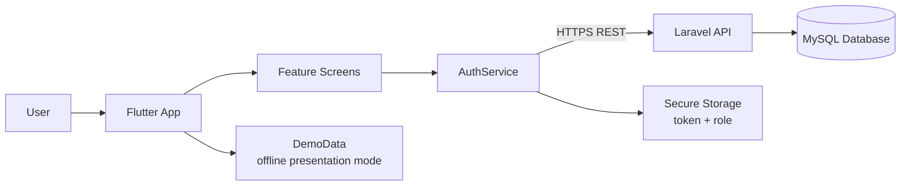

<p align="center">
  
</p>

<h1 align="center">Mon PF App</h1>

<p align="center">
  Application Flutter de gestion des commandes, paniers, livraisons, espace livreur et administration restaurant.
</p>

<p align="center">
  <a href="docs/tutorial/Mon_PF_App_Tutorial_Yassmine_Hajji.pdf"><strong>Lire le tutoriel PDF</strong></a>
  ·
  <a href="mon_pfapp/README.md"><strong>Lancer l'app</strong></a>
  ·
  <a href="docs/specifications/requirements-summary.md"><strong>Exigences</strong></a>
  ·
  <a href="docs/design/french-restaurant-app-ui-mockup.png"><strong>Reference UI</strong></a>
</p>

<p align="center">
  
  
  
  
  
</p>

## Project Identity

| Field | Value |
|---|---|
| Student | Yassmine Hajji |
| Academic context | Final year project |
| Field | Application development technologies |
| Product | Restaurant ordering and delivery management app |
| Primary targets | Android and Windows |

## What The App Covers

| Actor | Main workflow |
|---|---|
| Client | Login, menu browsing, cart, checkout, order tracking, order history, profile |
| Driver | Delivery dashboard, delivery availability, accept/refuse simulation, delivery metrics |
| Admin | Sales overview, active clients, orders, driver availability, stock alert |
| Backend-ready role | Laravel/MySQL REST API contract prepared for authentication and future data sync |

## Architecture



The app is currently demo-first so it can be tested during presentation without a backend outage. When the real API is ready, run with `DEMO_MODE=false` and provide `API_BASE_URL`.

## Repository Map

```text
.
├── docs/
│   ├── design/             # UI mockup reference and attribution
│   ├── specifications/     # Cahier de charge + analyse/conception
│   └── tutorial/           # PDF/DOCX guide, diagrams, screenshots
├── mon_pfapp/              # Flutter application
│   ├── lib/
│   │   ├── app/            # App shell, theme, navigation state
│   │   ├── core/           # API constants, secure storage, validators
│   │   ├── data/           # Demo data used without backend
│   │   ├── domain/models/  # User, menu item, cart item, order models
│   │   ├── features/       # Auth, client, driver/admin screens
│   │   └── shared/         # Reusable UI widgets
│   ├── test/               # Auth/navigation widget tests
│   └── docs/               # Technical project notes
└── tools/                  # Screenshot and tutorial generation scripts
```

## Current Status

| Area | Status |
|---|---|
| Flutter analysis | Passing |
| Flutter tests | Passing, 5 tests |
| Web release build | Passing |
| Android debug APK | Built |
| Android signed release APK | Built |
| Windows release | Blocked until Visual Studio ATL component is installed |
| Production backend | API contract prepared, real endpoints still required |

## Quick Start

```powershell
cd mon_pfapp
flutter pub get
flutter test
flutter run
```

Run against a real API:

```powershell
flutter run --dart-define=DEMO_MODE=false --dart-define=API_BASE_URL=https://votre-domaine/api
```

Install the Android release APK on a connected device:

```powershell
adb install -r build/app/outputs/flutter-apk/app-release.apk
```

<details>
<summary><strong>Backend contract</strong></summary>

The Flutter auth layer expects these REST endpoints:

| Method | Endpoint | Expected response |
|---|---|---|
| `POST` | `/register` | `token`, `user: { id, nom, email, role }` |
| `POST` | `/login` | `token`, `user: { id, nom, email, role }` |
| `POST` | `/logout` | Any successful logout response |

Public registration must create a `client` account only. Sensitive roles such as `admin` and `livreur` must be assigned server-side.

</details>

<details>
<summary><strong>Security decisions already applied</strong></summary>

- HTTPS/env-based API configuration through `API_BASE_URL`.
- `DEMO_MODE=true` by default for reliable local presentation.
- Removed public role selection during registration.
- Token and role stored through `flutter_secure_storage`.
- Auth requests include timeout and structured error handling.
- Async UI flows use `mounted` checks before updating state.
- Android signing files and keystores are ignored by Git.

</details>

## Documentation

| Document | Purpose |
|---|---|
| [Tutorial PDF](docs/tutorial/Mon_PF_App_Tutorial_Yassmine_Hajji.pdf) | Full explanation with stack, architecture, screenshots, algorithms, tests and presentation notes |
| [Editable tutorial DOCX](docs/tutorial/Mon_PF_App_Tutorial_Yassmine_Hajji.docx) | Source document for future edits |
| [Requirements summary](docs/specifications/requirements-summary.md) | Extracted project context from the supplied PDFs |
| [Setup and release guide](mon_pfapp/docs/setup_and_release.md) | Android/Windows setup, build commands and blockers |
| [Testing guide](mon_pfapp/docs/testing_guide.md) | How to verify app behavior |
| [Architecture notes](mon_pfapp/docs/architecture.md) | Short technical architecture reference |

## Production Notes

Android is the strongest target today: the SDK is installed, Flutter doctor passes, and the APK builds. Windows needs the Visual Studio component **C++ ATL for latest v142 build tools** because `flutter_secure_storage_windows` requires `atlstr.h`.

For a true production launch, the next technical steps are the Laravel/MySQL API, role middleware, real menu/order endpoints, delivery status synchronization, notification strategy, and CI/CD builds.
