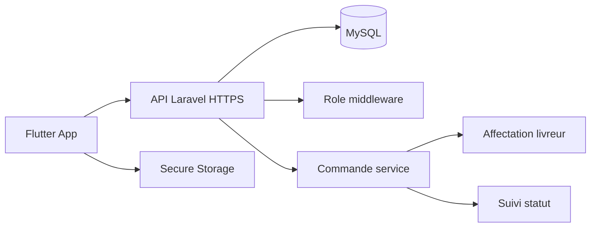

# Validation checklist - Cahier de charge et architecture

Ce document explique ce qui est deja couvert par l'application Flutter et ce qui reste a brancher pour valider completement le cahier de charge et l'architecture cible.

## Couverture actuelle

| Besoin | Etat | Commentaire |
|---|---|---|
| Connexion client | Couvert en demo + API auth preparee | `AuthService.login` gere demo, API HTTPS, timeout et erreurs. |
| Creation de compte client | Couvert en demo + API auth preparee | Le role public est force cote client; le serveur doit imposer le role definitif. |
| Consultation du menu | Couvert | Categories, recherche et images reelles de plats. |
| Ajout au panier | Couvert | Quantites, suppression, sous-total, livraison et total. |
| Passage de commande | Couvert en simulation | Le bouton dirige vers le suivi; il faut encore creer la commande en base via API. |
| Suivi de commande | Couvert en simulation | Etapes visuelles et progression; il faut encore synchroniser avec le backend. |
| Historique commandes client | Couvert en demo | Donnees statiques; API historique a brancher. |
| Espace livreur | Couvert en demo | Dashboard, commandes disponibles, accept/refuse visuel; API livreur a brancher. |
| Espace administrateur | Couvert en demo | Statistiques, commandes, equipe, alerte stock; CRUD reel a brancher. |
| Interface intuitive | Bien avance | UI modernisee avec logo, images de plats, transitions et composants coherents. |
| Securite auth/token | Bien avance cote app | HTTPS/env config, secure storage, timeouts, suppression role public. |

## Points restants pour valider 100% le cahier de charge

| Priorite | Reste a faire | Pourquoi c'est necessaire |
|---|---|---|
| Haute | Backend Laravel/MySQL reel | Le cahier de charge demande une gestion persistante, pas seulement une demo locale. |
| Haute | Tables MySQL: users, plats, commandes, lignes_commande, livraisons, roles | Necessaire pour stocker menu, clients, commandes et affectations. |
| Haute | CRUD menu admin | Ajouter, modifier, supprimer et changer la disponibilite des plats. |
| Haute | Creation commande via API | Le panier doit devenir une commande sauvegardee. |
| Haute | Mise a jour etat commande | Admin/serveur/livreur doivent changer les etats en base. |
| Haute | Affectation livreur | L'administrateur ou le systeme doit assigner une commande a un livreur. |
| Moyenne | Espace serveur dedie | Le cahier mentionne le serveur; actuellement il est represente dans le flux operations/admin. |
| Moyenne | Synchronisation temps reel ou polling | Le client doit voir les changements de statut sans simulation locale. |
| Moyenne | Tests d'integration backend | Valider auth, panier, commande, livreur, admin avec l'API reelle. |
| Moyenne | Deploiement HTTPS API | L'app refuse le cleartext traffic pour une logique production. |
| Basse | Paiement en ligne | Non indispensable si le projet garde paiement a la livraison, mais utile en evolution. |
| Basse | Notifications push | Utile pour informer client/livreur des changements de commande. |

## Architecture cible a presenter

## Decision pour la soutenance

La version actuelle est suffisante pour une demonstration UI/UX et architecture frontend: elle montre les trois espaces principaux, les regles metier, la securite cote app et un parcours client complet.

Pour une validation complete comme systeme de production, il faut brancher le backend Laravel/MySQL et remplacer les donnees `DemoData` par des appels API reels.
