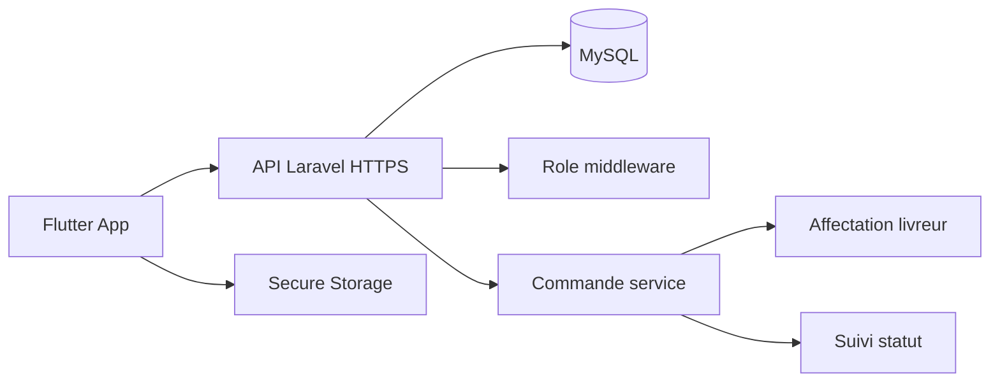

# Validation checklist - Cahier de charge et architecture

Ce document explique ce qui est deja couvert par l'application Flutter et ce qui reste a brancher pour valider completement le cahier de charge et l'architecture cible.

## Couverture actuelle

| Besoin | Etat | Commentaire |
|---|---|---|
| Connexion client | Couvert demo + API reelle | `AuthService.login` gere demo, API, timeout et erreurs. |
| Creation de compte client | Couvert demo + API reelle | Le backend force toujours le role `client`. |
| Consultation du menu | Couvert demo + API reelle | Categories, recherche et images reelles de plats. |
| Ajout au panier | Couvert | Quantites, suppression, sous-total, livraison et total. |
| Passage de commande | Couvert demo + API reelle | Le panier cree une commande sauvegardee via `/api/orders`. |
| Suivi de commande | Couvert partiellement | L'ecran affiche la commande active; synchronisation temps reel reste une evolution. |
| Historique commandes client | Couvert demo + API reelle | `/api/orders` retourne les commandes selon le role connecte. |
| Espace livreur | Couvert demo + API reelle | `/api/driver/orders` et acceptation de livraison sont disponibles. |
| Espace administrateur | Couvert demo + API reelle | Stats, commandes et endpoints CRUD menu existent cote API. |
| Interface intuitive | Bien avance | UI modernisee avec logo, images de plats, transitions et composants coherents. |
| Securite auth/token | Bien avance cote app | HTTPS/env config, secure storage, timeouts, suppression role public. |

## Points restants pour valider 100% le cahier de charge

| Priorite | Reste a faire | Pourquoi c'est necessaire |
|---|---|---|
| Haute | Hebergement HTTPS API | Necessaire pour tester une APK release contre un serveur distant. |
| Haute | Remplacer SQLite par MySQL/PostgreSQL heberge | SQLite valide le demo-prod local; MySQL/PostgreSQL valide mieux une production reelle. |
| Moyenne | UI admin CRUD menu complete | Les endpoints existent; il reste a ajouter les formulaires admin Flutter. |
| Moyenne | Synchronisation temps reel ou polling | Le client doit voir les changements de statut automatiquement. |
| Moyenne | Espace serveur dedie | Le cahier mentionne le serveur; actuellement il est represente dans le flux operations/admin. |
| Moyenne | Tests d'integration bout-en-bout sur telephone | Backend et Flutter ont des tests; il faut valider sur appareil physique. |
| Basse | Paiement en ligne | Non indispensable si le projet garde paiement a la livraison, mais utile en evolution. |
| Basse | Notifications push | Utile pour informer client/livreur des changements de commande. |

## Architecture cible a presenter

## Decision pour la soutenance

La version actuelle est suffisante pour une demonstration demo-prod: elle montre les trois espaces principaux, les regles metier, la securite cote app, un backend Laravel, une base SQLite persistante et un parcours client complet avec commande creee via API.

Pour une vraie production commerciale, il reste surtout le deploiement HTTPS, une base hebergee, les notifications, et un durcissement auth type Laravel Sanctum.
