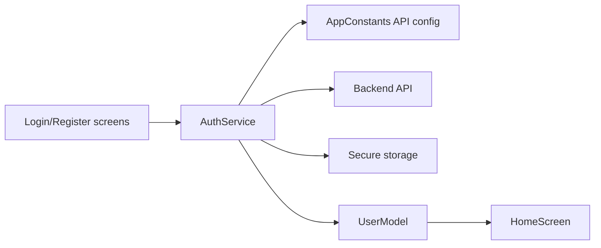

# Contexte du projet

## Identite

- Etudiante : Yassmine Hajji
- Projet : application mobile de restauration et livraison
- Cadre : projet de fin d'annee
- Filiere : developpement d'applications
- Technologie principale : Flutter

## But fonctionnel

Le projet met en place la base d'une application mobile connectee a un backend.
La partie presente dans ce depot couvre maintenant l'authentification et un
parcours de commande complet :

- un utilisateur peut se connecter ;
- un nouveau client peut creer un compte ;
- l'application conserve un jeton de session ;
- l'utilisateur arrive sur un ecran d'accueil ;
- l'utilisateur consulte le menu ;
- l'utilisateur gere un panier ;
- l'utilisateur suit une livraison ;
- le livreur consulte ses commandes ;
- l'administrateur consulte les indicateurs et l'equipe ;
- l'utilisateur peut se deconnecter.

## Architecture fonctionnelle

Le code Flutter est maintenant organise par couches :

- `app/` pour le lancement et la navigation principale ;
- `domain/models/` pour les objets metier du diagramme de classe ;
- `features/auth/` pour l'authentification ;
- `features/client/` pour les parcours client ;
- `features/operations/` pour administrateur et livreur ;
- `shared/widgets/` pour les composants visuels reutilisables.

## Pourquoi les corrections etaient importantes

Avant les corrections, le projet ressemblait encore a un prototype Flutter :
URL API codee en dur, role admin visible a l'inscription, stockage non securise
du token, test par defaut du compteur Flutter, et metadata de release encore en
mode exemple. Les corrections rendent le projet plus credible pour une
soutenance et plus proche d'une application deployable.
